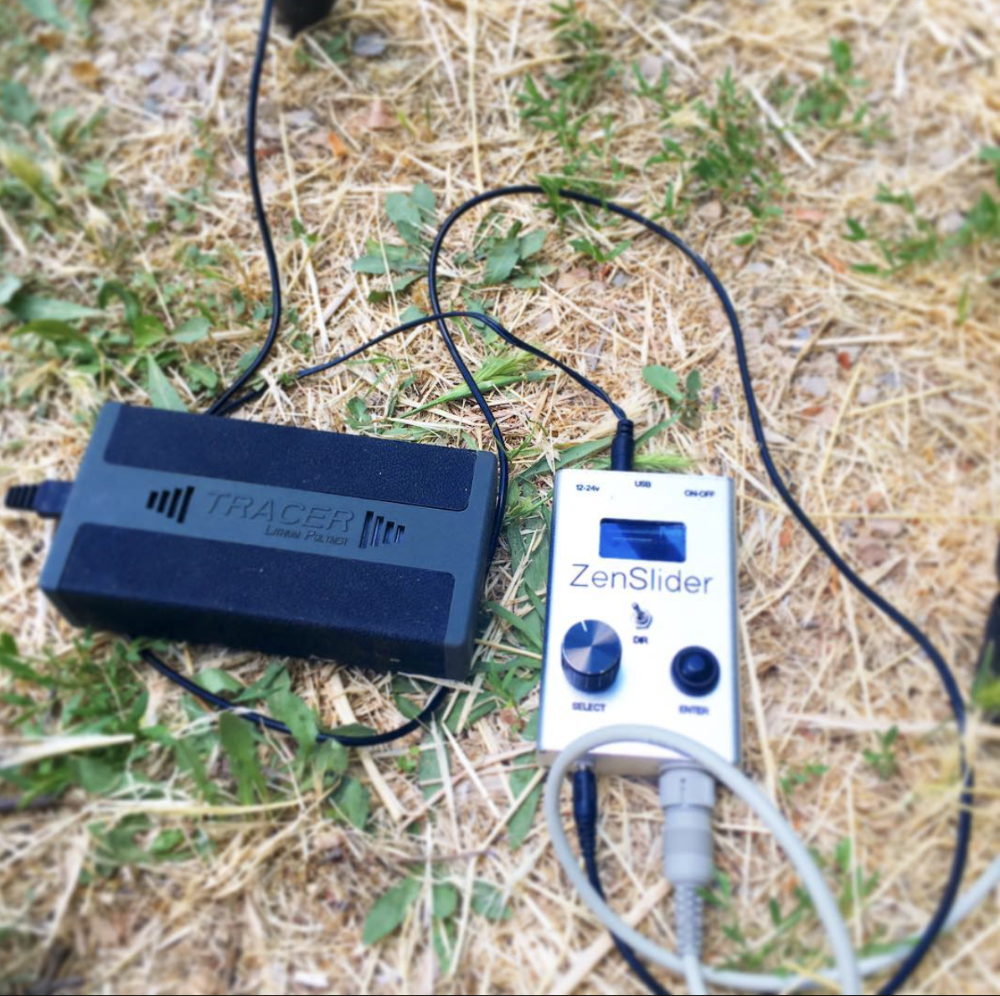

# ZenSlider-firmware
Motion control controller based on ATMEGA644p microcontroller.

This firmware is intended to be used in an Atmel (Microchip) ATMEGA644p 8 bit microcontroller. 
Originally designed to manage [ZenSlider and ZenFocus devices](http://zenslider.com) 

## IO
Inputs

* Rotary encoder (pressed and angular movement)
* Select button
* Direction switch

Outputs

- Stepper motor controller (Texas Instruments DRV8255)
- Camera trigger
- 1.3'' OLED display controller (SPI protocol SSD1306)

